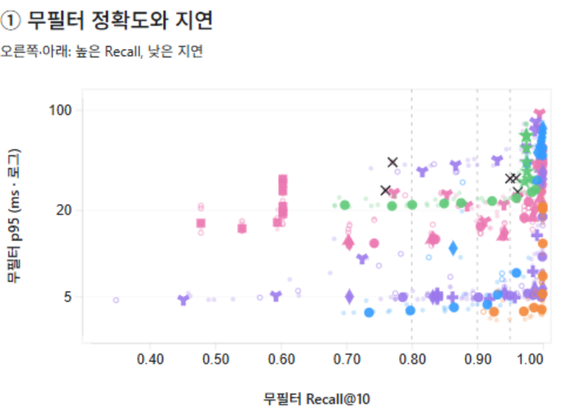

# UBot Vector DB 벤치마크

UBot FAQ 검색에 쓸 Vector DB를 고르려고 pgvector·Qdrant·Weaviate·Milvus·OpenSearch를 같은 BGE-M3 1024차원 벡터로 비교한 Spring Boot 하네스입니다.

> [!IMPORTANT]
> **결론: 별도 Vector DB 없이 PostgreSQL의 pgvector를 사용합니다.**
> 같은 Recall에서 Qdrant·OpenSearch가 더 빨랐지만 차이는 p50 1~2ms, p95 수 ms~수십 ms였습니다. 절대적으로 크지 않다고 보고, 이미 쓰는 PostgreSQL에 FAQ와 벡터를 함께 두는 편의성을 우선했습니다.
> 근거와 남은 확인 항목은 [선정 결론](docs/07-results/decision.md)에 있습니다.

## 결과 요약

합성 10k 청크 · Top-10 · 동시성 10에서 같은 설정을 5회 재구축해 측정했습니다. Recall은 평균, 나머지는 중앙값입니다.

| 구성 (Recall 약 0.96) | Recall | p50 ms | p95 ms | QPS | peak RAM |
|---|---:|---:|---:|---:|---:|
| **pgvector** HNSW ef_search=200 | 0.962 | 3.35 | 7.34 | 2,454 | 0.21GiB |
| Qdrant HNSW hnsw_ef=20 | 0.968 | 2.56 | 3.94 | 3,635 | 0.10GiB |
| OpenSearch Lucene HNSW candidate_k=400 | 0.961 | 3.49 | 4.93 | 2,731 | 4.71GiB |

Recall 약 0.99에서는 pgvector(ef_search=400)의 p95가 32.2ms로 Qdrant(4.2ms)보다 약 28ms 느렸습니다. Milvus·Weaviate를 포함한 비교는 [선정 결론](docs/07-results/decision.md), 124개 설정 전체는 [수치 부록](docs/07-results/assets/fairness-v2-20260912-1826/parameter-statistics.md)에 있습니다.



색: 파랑 pgvector · 주황 Qdrant · 보라 OpenSearch · 분홍 Milvus · 초록 Weaviate. 오른쪽 아래일수록 Recall이 높고 빠릅니다. 범례와 처리량·메모리·필터 그림은 [6축 산포도](docs/07-results/assets/fairness-v2-20260912-1826/scatter-multi-axis.png)에 있습니다.

> [!NOTE]
> 벤치마크의 pgvector 조건(Top-10, `ef_construction=128`, 인덱스 사용 강제)은 UBot-BE 실제 설정(Top-3, pgvector 기본 파라미터)과 다릅니다. 항목별 차이는 [선정 결론](docs/07-results/decision.md#ubot-be-현재-설정과-벤치마크-조건의-차이)에 있습니다.

## 무엇을 비교했나

| DB | Engine | Index |
|---|---|---|
| pgvector | PostgreSQL | HNSW, IVFFlat |
| Qdrant | Native | HNSW |
| Weaviate | Native | HNSW, HFresh |
| Milvus | Native | HNSW, IVF_FLAT, IVF_SQ8, IVF_PQ, DISKANN |
| OpenSearch | Lucene | HNSW |
| OpenSearch | Faiss | HNSW, IVF |
| OpenSearch | JVector | DiskANN |

| 고정 조건 | 값 |
|---|---|
| 데이터 | 합성 한국어 청크 10,000개, BGE-M3 dense 1024차원, cosine |
| 질의 | 300개 중 evaluation 200개(무필터 180 + 필터 20)로 측정 |
| 부하 | Top-10, 동시성 10, 설정마다 최소 30초·자원 표본 30개 |
| 자원 | DB당 4 vCPU / 8GiB / swap 없음 (Milvus는 etcd·MinIO 포함) |
| 반복 | 구성마다 5회 재구축, 회차별 DB 순서 교차 |
| 정답 | Java로 계산한 exact cosine Top-10과 비교한 Recall@10 |

속도만 비교하면 Recall이 낮은 설정이 빠르게 보입니다. 그래서 인덱스마다 검색 폭(ef, nprobe 등)을 전부 바꿔 가며 Recall과 지연을 함께 측정했습니다. 14개 구성 × 124개 검색 설정 × 5회 = 620개 측정입니다. 검색 오류와 응답 계약 위반은 0건이고, 워밍업 경고 170건과 Milvus DISKANN Recall 변동 5건은 표시한 채 보존했습니다.

## 실행

Java 21, Docker Desktop, PowerShell이 필요합니다. 임베딩 파일을 새로 만들 때는 Ollama `bge-m3`도 필요합니다. 처음이라면 [로컬 준비](docs/04-quickstart/local-setup.md)부터 봅니다.

```powershell
.\gradlew.bat test
.\gradlew.bat bootJar
.\scripts\run-all-benchmarks.ps1 -Repetitions 5 -ResultDirectory benchmark-result/fairness-v2-new
```

일부 구성만 돌리려면 `-TestIds T01,T05`를 붙입니다. 새 실험마다 새 결과 디렉터리를 씁니다.

<details>
<summary>필터 선택도 · 대규모 · 실제 데이터 검증 스크립트</summary>

필터가 문서의 1%/10%/50%만 남기는 경우를 따로 측정합니다.

```powershell
.\scripts\run-filter-selectivity-benchmarks.ps1 -TestIds T01,T05,T07 -Repetitions 3
```

데이터가 10만 건 이상으로 늘었을 때 다시 측정합니다. 실제 벡터 파일이 필요하며 건수가 모자라면 실행하지 않습니다.

```powershell
.\scripts\run-shortlist-scale-validation.ps1 -TestIds T01,T05,T07 -Scale 100000 `
  -DocumentVectors D:\dataset\documents-100k.jsonl `
  -QueryVectors D:\dataset\queries-vectors.jsonl `
  -QueryDefinitions D:\dataset\queries.jsonl
```

실제 FAQ·질의로 측정합니다. 입력에 `synthetic:true`가 하나라도 있으면 거부합니다.

```powershell
.\scripts\run-real-workload-validation.ps1 -TestIds T01,T05,T07 `
  -DocumentVectors D:\project-data\documents.jsonl `
  -QueryVectors D:\project-data\queries-vectors.jsonl `
  -QueryDefinitions D:\project-data\queries.jsonl
```

</details>

## 결과 파일

```text
benchmark-result/<실행 이름>/
├─ raw/        측정마다 원시 JSON, exact 정답, 질의별 감사 기록
├─ csv/        전체 측정 CSV
├─ summary/    같은 설정의 반복 집계 (평균·중앙값·min/max)
├─ charts/     Recall–p95 산포도 SVG
└─ failures/   실행 오류 기록
```

`benchmark-result/`는 git에 올리지 않습니다. 필드 정의는 [결과 형식](docs/06-implementation/result-format.md)에 있습니다.

## 문서

**현재 기준**

- [선정 결론: pgvector](docs/07-results/decision.md)
- [fairness-v2 620개 측정 보고서](docs/07-results/fairness-v2-results-20260913.md)
- [문서 읽기 순서](docs/README.md)
- [실행 프로토콜](docs/03-benchmark-design/fairness-v2.md) · [측정 지표](docs/03-benchmark-design/metrics.md) · [측정 한계](docs/03-benchmark-design/limitations.md)
- [DB별 구현](docs/05-databases/) · [결과 형식](docs/06-implementation/result-format.md) · [문제 해결](docs/08-troubleshooting/common-issues.md)

**역사 자료** — 측정 조건이 달라 최신 결과와 합산하지 않습니다.

- [v1 sweep 372개](docs/07-results/sweep-results-20260911.md) · [목표별 선택 84개](docs/07-results/matrix-results-20260911.md) · [그 밖의 과거 기록](docs/07-results/README.md)
